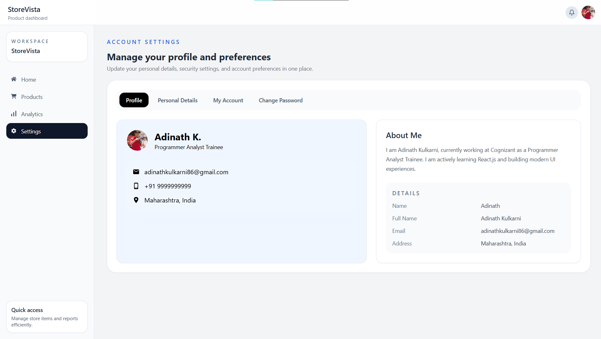

# StoreVista Dashboard

<p align="center">
  
</p>
  
A full-stack admin dashboard built with **React 19** (frontend) and **Java Spring Boot** (backend). Manage products, visualize analytics, and configure account settings — all in a polished, responsive UI.

---

## 🚀 Features

### 📊 Dashboard (Home)
- Welcome message with personalized greeting
- Summary price cards — Total Earning, Total Order, Total Income (with live badges)
- Sales Overview — grouped bar chart (Expenses vs Losses vs Profit) across years
- Popular Products — expandable accordion listing top-selling items

### 📦 Product Management
- Full **CRUD operations** (Create, Read, Update, Delete)
- Real-time search/filter by name, SKU, or category
- Modal-based add/edit form with input validation
- Summary stats — total products, visible results, active search term
- Loading spinner and empty-state placeholders

### 📈 Analytics
- Revenue Trend — dual line chart (Revenue & Orders over 6 months)
- Sales by Category — doughnut pie chart (Electronics, Fashion, Home, Accessories)
- Monthly Comparison — bar chart comparing Revenue vs Orders
- KPI cards — Total Revenue, Orders, Customer Retention
- Key Insights panel

### ⚙️ Settings
- Tabbed interface with 4 sections:
  - **Profile** — user avatar, name, email, phone, location, about section
  - **Personal Details** — editable name, location, bio, role, contact info
  - **My Account** — username/email fields, role/location selectors, team member toggle switches
  - **Change Password** — current/new/confirm password fields with update button

### 🧭 Navigation
- Fixed **NavBar** with brand identity, notification bell, and profile image
- Fixed **Sidebar** with workspace info, 4 navigation links (Home, Products, Analytics, Settings), active route highlighting, and quick-access footer card

---

## 🛠 Tech Stack

| Frontend | Backend |
|---|---|
| [React 19](https://react.dev/) | Java 17+ |
| [Vite 8](https://vitejs.dev/) | Spring Boot 3 |
| [Tailwind CSS 3](https://tailwindcss.com/) | Spring Web (REST API) |
| [Material UI 9](https://mui.com/) | Spring Data JPA / Hibernate |
| [MUI X-Charts](https://mui.com/x/react-charts/) | MySQL (or any JPA-compatible DB) |
| [React Router 7](https://reactrouter.com/) | Maven |
| [React Icons](https://react-icons.github.io/react-icons/) | — |

### Key Frontend Libraries
| Package | Purpose |
|---|---|
| `@mui/material` + `@emotion/react` | Material UI components and styling |
| `@mui/x-charts` | LineChart, BarChart, PieChart |
| `react-icons` | Icon sets (Feather, FontAwesome, Ionicons, etc.) |
| `react-router` | Client-side routing |
| `tailwindcss` + `postcss` + `autoprefixer` | Utility-first CSS |
| `eslint` | Code linting |

---

## 📁 Project Structure

```
frontend/
├── public/
│   ├── favicon.svg              # Site favicon
│   └── icons.svg                # SVG icon sprite
├── screenshots/
│   ├── home.png                 # Home page screenshot
│   ├── products.png             # Products page screenshot
│   ├── analytics.png            # Analytics page screenshot
│   └── settings.png             # Settings page screenshot
├── src/
│   ├── assets/
│   │   └── DSC09745 (1).jpg     # Profile avatar image
│   ├── components/
│   │   ├── NavBar.jsx           # Top navigation bar
│   │   ├── Sidebar.jsx          # Side navigation with links
│   │   ├── home/
│   │   │   ├── Accordian.jsx    # Popular products wrapper
│   │   │   ├── Histogram.jsx    # Grouped bar chart (expenses/losses/profit)
│   │   │   ├── Options.jsx      # MUI Accordion items
│   │   │   └── PriceCard.jsx    # Gradient summary card
│   │   ├── products/
│   │   │   ├── Input.jsx        # Search input field
│   │   │   ├── Product.jsx      # Single product row card
│   │   │   ├── ProductList.jsx  # Product listing with header
│   │   │   └── Spinner.jsx      # Loading spinner animation
│   │   └── settings/
│   │       ├── Tabs.jsx         # Tab switcher (Profile / Personal / Account / Password)
│   │       ├── ProfileTab.jsx   # Profile card with user info
│   │       ├── PersonalDetailsTaBb.jsx  # Personal & contact info form
│   │       ├── AccountsTab.jsx  # General & advanced settings
│   │       ├── ChangePasswordTab.jsx    # Password change form
│   │       └── SliderButton.jsx # Toggle switch component
│   ├── pages/
│   │   ├── Home.jsx             # Dashboard home page
│   │   ├── Products.jsx         # Product management page
│   │   ├── Analytics.jsx        # Analytics & charts page
│   │   └── Settings.jsx         # Account settings page
│   ├── styles/
│   │   └── bodyCss.css          # Custom CSS (gradients, loader animation)
│   ├── App.css                  # Root app styles
│   ├── App.jsx                  # Root component with router setup
│   ├── index.css                # Tailwind directives & base styles
│   └── main.jsx                 # Entry point — React DOM render
├── index.html                   # HTML shell
├── vite.config.js               # Vite configuration
├── tailwind.config.js           # Tailwind CSS configuration
├── postcss.config.js            # PostCSS configuration
├── eslint.config.js             # ESLint configuration
├── package.json                 # Dependencies & scripts
├── package-lock.json            # Dependency lock file
└── README.md                    # You are here 😊
```

```
backend/
├── pom.xml                                      # Maven build file
├── HELP.md                                      # Spring Boot generated help
├── mvnw / mvnw.cmd                              # Maven wrapper scripts
└── src/
    ├── main/
    │   ├── java/com/storevista/
    │   │   ├── StorevistaApplication.java        # Spring Boot entry point
    │   │   ├── config/
    │   │   │   └── CorsConfig.java               # CORS policy (allows frontend on localhost)
    │   │   ├── controller/
    │   │   │   └── ProductController.java        # REST controller — CRUD endpoints
    │   │   ├── dto/
    │   │   │   ├── ProductRequestDto.java        # Incoming product payload
    │   │   │   └── ProductResponseDto.java       # Outgoing product response
    │   │   ├── entity/
    │   │   │   └── Product.java                  # JPA entity (id, name, price, category, date, sku)
    │   │   ├── exception/
    │   │   │   ├── DuplicateSkuException.java    # Thrown on duplicate SKU
    │   │   │   ├── ResourceNotFoundException.java # Thrown when product not found
    │   │   │   └── GlobalExceptionHandler.java   # Global error handler (404, 409, 500)
    │   │   ├── mapper/
    │   │   │   └── ProductMapper.java            # Maps Entity ↔ DTO
    │   │   ├── repository/
    │   │   │   └── ProductRepository.java        # JPA repository
    │   │   └── service/
    │   │       └── ProductService.java           # Business logic layer
    │   └── resources/
    │       └── application.properties            # DB config, server port, etc.
    └── test/
        └── java/com/storevista/
            └── StorevistaApplicationTests.java   # Basic application context test
```

---

## 📦 Installation & Setup

### Prerequisites
- **Node.js** 18+ & npm
- **Java** 17+ JDK
- **Maven** (or use the included `mvnw` wrapper)
- **MySQL** (or configure another database)

### Frontend Setup

```bash
# Navigate to the frontend directory
cd frontend

# Install dependencies
npm install

# Start the development server (default: http://localhost:5173)
npm run dev
```

### Backend Setup

```bash
# Navigate to the backend directory
cd backend

# Configure your database in src/main/resources/application.properties
# Example:
# spring.datasource.url=jdbc:mysql://localhost:3306/storevista
# spring.datasource.username=root
# spring.datasource.password=yourpassword

# Build and run the application (default: http://localhost:8080)
./mvnw spring-boot:run
```

> **Note:** On Windows, use `mvnw.cmd spring-boot:run` instead.

---

## 📜 Available Scripts

### Frontend

| Script | Description |
|---|---|
| `npm run dev` | Start Vite development server with HMR |
| `npm run build` | Build for production (output in `dist/`) |
| `npm run preview` | Preview the production build locally |
| `npm run lint` | Run ESLint on the codebase |

### Backend

| Command | Description |
|---|---|
| `./mvnw spring-boot:run` | Start the Spring Boot application |
| `./mvnw clean package` | Build the project as a JAR |
| `./mvnw test` | Run tests |

---

## 🔌 API Endpoints

All endpoints are prefixed with `http://localhost:8080/api/products`.

| Method | Endpoint | Description | Request Body |
|---|---|---|---|
| `GET` | `/api/products` | Get all products | — |
| `GET` | `/api/products/{id}` | Get a single product by ID | — |
| `POST` | `/api/products` | Create a new product | `{ "name", "price", "category", "date", "sku" }` |
| `PUT` | `/api/products/{id}` | Update an existing product | `{ "name", "price", "category", "date", "sku" }` |
| `DELETE` | `/api/products/{id}` | Delete a product by ID | — |

### Error Responses
| Status | Description |
|---|---|
| `404 Not Found` | Product with the given ID does not exist |
| `409 Conflict` | SKU already exists (duplicate) |
| `500 Internal Server Error` | Unexpected server error |

---

## 🌐 Routing

| Path | Page | Description |
|---|---|---|
| `/` | Home | Dashboard with cards and charts |
| `/products` | Products | Product CRUD management |
| `/analytics` | Analytics | Charts and performance metrics |
| `/settings` | Settings | Profile and account configuration |

The layout includes a fixed **NavBar** (top) and **Sidebar** (left, 240px wide). The main content area has `pt-16 ml-[240px]` padding to accommodate them.

---

## 🖼️ Screenshots

### Home Page


### Products Page


### Analytics Page


### Settings Page


---

---

## 📄 License

This project is for demonstration and learning purposes. Feel free to use, modify, and adapt it as needed.

---
