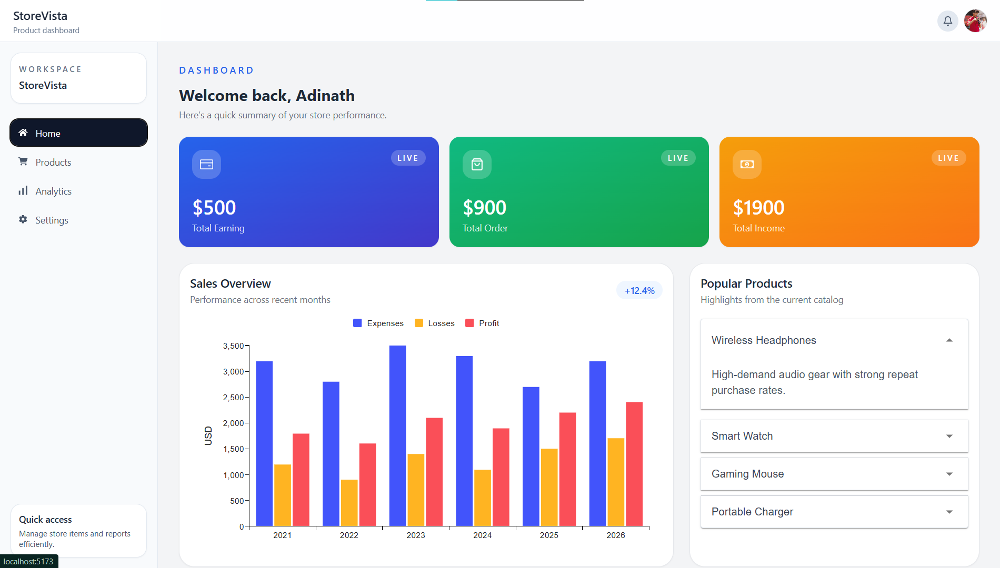
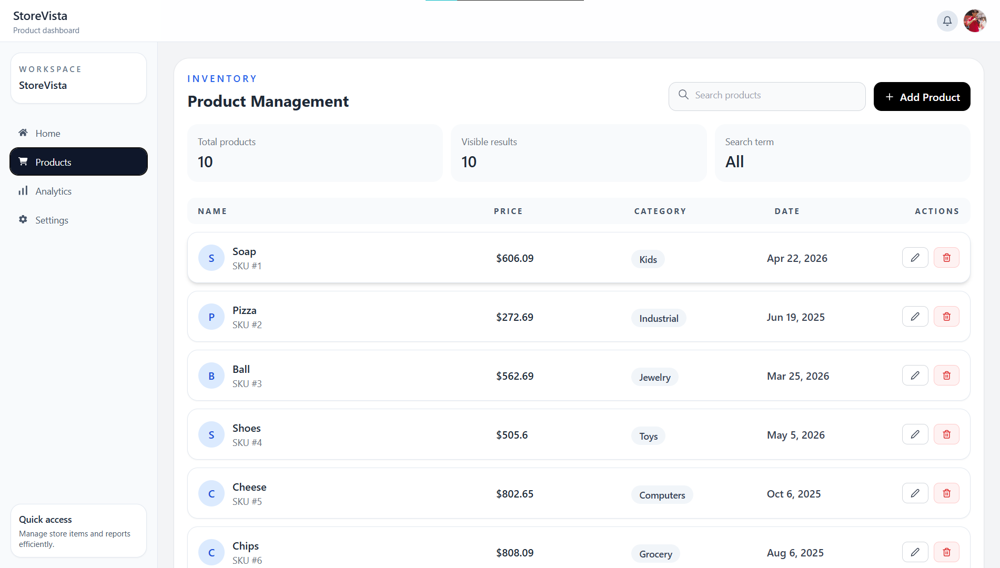
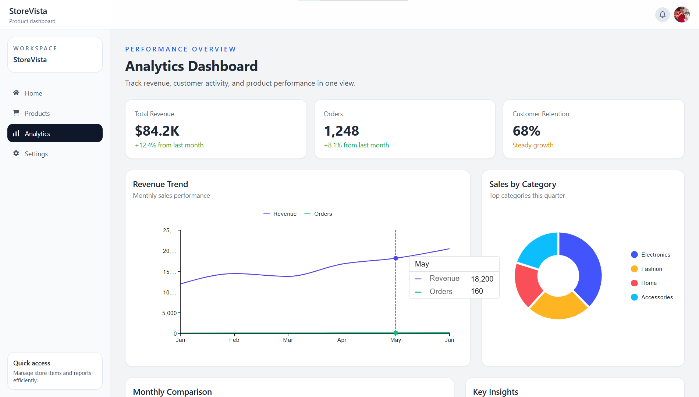

# StoreVista Dashboard

A modern React-based admin dashboard built with Vite, Tailwind CSS, and Material UI. This project showcases a polished user interface for managing products, viewing analytics, and updating account settings.

## Features

- Responsive dashboard home page
- Product management with add, edit, delete, and search functionality
- Analytics page with charts and summary insights
- Settings page with profile and account-related sections
- Clean, reusable component structure

## Tech Stack

- React
- Vite
- Tailwind CSS
- Material UI
- React Router
- React Icons

## Project Structure

- src/pages - Main application pages
- src/components - Reusable UI components grouped by page
- src/styles - Global styling

## Installation

1. Clone the repository
2. Install dependencies:
   ```bash
   npm install
   ```
3. Start the development server:
   ```bash
   npm run dev
   ```

## Build

```bash
npm run build
```

## Screenshots.

git 





## Summary

Built a responsive admin dashboard application using React and modern UI libraries, featuring product CRUD operations, analytics visualization, and a polished settings experience.

